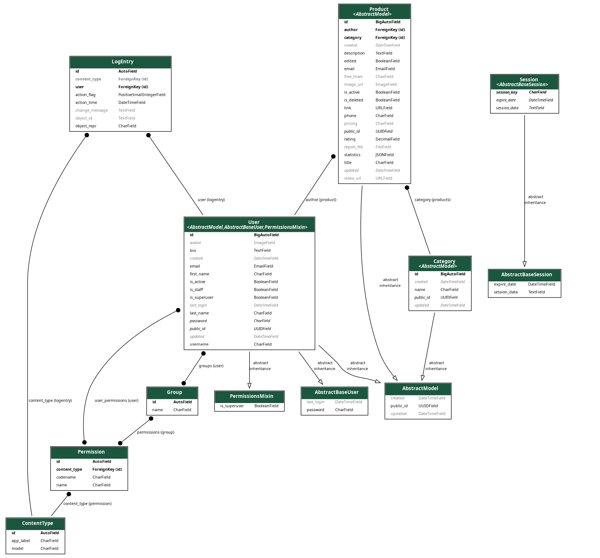

# API

**<h3>How to use</h3>**

*Product*

|        |                                |     |
|:-------|:------------------------------:|----:|
| GET    |       /api/products/:id        |     |
| POST   |         /api/products/         |     |
| DELETE |         /api/products/         |     |
| PUT    |            /api/products/             |     |

*User*

|      |                          |     |
|:-----|:------------------------:|----:|
| GET  |   /api/auth/users/:id/   |     |
| POST | /api/auth/users/register |     |
| POST |  /api/auth/users/login/  |     |
| PUT  |     

